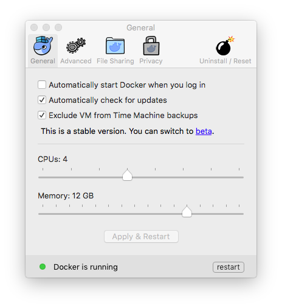

Copyright &copy; 2016, 2018  International Business Machines Corporation
All Rights Reserved

## Docker 'centos7-base' for preparing subsets of IBM Streams

This repository contains a Dockerfile and associated scripts that install IBM Streams and prepare subsets of it, intended for use with [Docker](https://www.docker.com/). It creates an image or container consisting of:

* CentOS release 7
* Xfce desktop version 4
* servers for SSH and VNC access
* some open-source utilities, tools, and libraries

The image allows Streams subsets to be generated automatically from the host computer. The container provides an Xfce desktop for those who prefer to log in via SSH or VNC.

**Note:** The Streams install and subset preparation scripts require substantial memory and disk space for Docker plus additional space on a network server that is accessible by both HTTP and SFTP. Please refer to the guidance below for details.

### install Docker

Install [Docker for Windows](https://docs.docker.com/windows/) or [Docker for Mac](https://docs.docker.com/mac/) (and see [Docker on Windows](https://developer.ibm.com/bluemix/2015/04/16/installing-docker-windows-fixes-common-problems/) for help with common problems, if needed).

The resources Docker allocates by default are insufficient for preparing subsets of IBM Streams. Use the Docker 'Preferences' panel to increase memory to at least 12GB and disk to at least 50GB, like this:

### get this repository

To prepare subsets of IBM Streams for use with Docker, clone or download the 'git' repository ['docker-centos-streams'](https://github.com/ejpring/docker-centos-streams).

### configure network directories

The preparation scripts in this directory will automatically install IBM Streams in a Docker container. The Streams install packages are compressed 'tar' files (that is, '.tar.gz' files), and are each about 3.5GB in size. They may have names like these, depending upon the release, and must be available from a server via HTTP:

    Streams-DE-4.2.0.0-x86_64-el7.tar.gz 
    Streams-4.2.1.2-x86_64-el7.tar.gz
    streams.install-4.2.4.2-20180315.195442-15.el7.tar.gz

The preparation scripts will create three subsets of IBM Streams suitable for developing, building, and running applications, packaged as more compressed 'tar' files, totalling about 2.8GB in size. The scripts will store them on another server via SFTP.

**Note:** The preparation scripts use the 'scp' command to upload subset packages to an SFTP server. To enable them, you will need a user account on that server. To avoid password prompts from the 'scp' command, you should generate an SSH key pair, if you do not already have them, and store the public key on the server.

The preparation scripts get server URLs and package names from a configuration file. Before using them, change the parameters in this file to match your environment:

    $HOME/git/docker-centos-streams/config/centos7.cfg

### create Streams subsets automatically

First, to create a Docker image for creating subsets of Streams, execute this script, which will run for about eight minutes with a fast network connection:

    $HOME/git/docker-centos-streams/centos7-base/createDockerImage.sh

The 'centos7-base' image only needs to be created once.

Whenever a Streams install package is released, store it in the Streams install package server and put the package name in the configuration file.

Then, to create subsets of Streams for that release, execute this script, which will run for at least half an hour:

    $HOME/git/docker-centos-streams/centos7-base/createStreamsSubsets.sh

This script will install the Streams release specified by the configuation files in a Docker container, and then create three subsets of it suitable for developing, compiling, and running application. The packages will be uploaded to the Streams subset package server with names like these:

    StreamsSubset.centos7-streams4242-dev.tar.gz
    StreamsSubset.centos7-streams4242-bld.tar.gz
    StreamsSubset.centos7-streams4242-run.tar.gz 

After creating Streams subset packages, they can be used by the Dockerfiles and scripts in these directories to create images and containers for developing, compiling, and running Streams applications:

    [centos7-streams42-dev](../centos7-streams42-dev) creates a container for application development
    [centos7-streams42-bld](../centos7-streams42-bld) creates an image for compiling applications
    [centos7-streams42-run](../centos7-streams42-run) creates an image for running applications

### or, create a container for creating Streams subsets

Alternatively, you may prefer to create a Docker container from the 'centos7-base' image, start it, and log into it with SSH or VNC. To create the container, execute this script:

    $HOME/git/docker-centos-streams/centos7-base/createDockerContainer.sh

and start the container by executing this command:

    docker start centos7-base

You can use the Xfce desktop of the 'streamsdev' user account by connecting a VNC viewer to the address 'localhost:1' or 'localhost:5901', depending on which viewer you use:

The icons at the top of the Xfce desktop launch common tools:

* the 'Display' icon changes the size of the Xfce desktop
* the 'Terminal' icon opens a Bash window with a command-line prompt
* the 'File Manager' icon opens a directory and file explorer
* the 'Gedit' icon opens the Gnome text editor
* the 'Firefox' icon opens the Firefox web browser
* the 'Emacs' icon opens the Gnu Emacs text editor
* the 'top' icon opens the 'top' system status tool

Or, you can login to the 'streamsdev' user account with SSH by typing this command at a prompt in a Terminal window:

    ssh -p 2222 streamsdev@localhost

In any case, within the container, the 'config' and 'prepare' directories from the host computer's file system are mounted in the home directory of the 'streamsdev' user account.

When you are finished with the container, You can stop it by executing this command:

    docker stop centos7-streams42-dev

