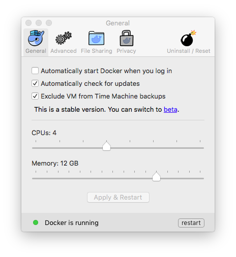
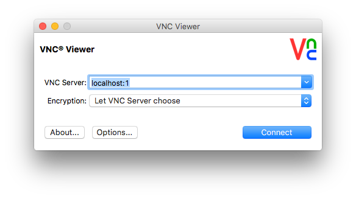

Copyright &copy; 2016, 2018  International Business Machines Corporation
All Rights Reserved

## Docker container 'centos7-streams42-dev'

This repository contains a Dockerfile and associated scripts, intended for use with [Docker](https://www.docker.com/). It creates a container for [IBM Streams](http://ibmstreams.github.io/) application development, consisting of:

* a development subset of **IBM Streams release 4.2**
* CentOS release 7
* Xfce desktop version 4
* Java 1.8
* Python 2.7 and 3.5
* servers for SSH and VNC access
* lots of open-source utilities, tools, and libraries

The container provides an Xfce desktop for those who prefer to develop applications with GUI tools, including Streams Studio, and also supports SSH access for those who prefer command-line tools. The host directory of the user account in the container is mounted from a directory in the host computer's file system, initialized with a basic Xfce configuration.

To build the container, Docker will need access to an HTTP server where subsets of IBM Streams have been stored. See ['centos7-base'](../centos7-base) for instructions on preparing subsets of IBM Streams.

Building the container will take about XXX minutes with a fast network connection. It will be about XXX GB in size.

### quick start procedure

The procedure for building the container is described in detail below, but if you are familiar with Docker, then you may want to follow this procedure to get started quickly:

* prepare Streams subsets (see the ['centos7-base' directory](../centos7-base))
* install [Docker](https://www.docker.com) and increase its processor and memory resources
* get the ['docker-centos-streams'](https://github.com/ejpring/docker-centos-streams/) repository
* execute the 'createDockerContainer.sh' script and then start the container
* login to the container's Xfce desktop by connecting a VNC viewer to 'localhost:5901'
* login to the container's command line with 'ssh -p 2222 streamsdev@localhost'

All passwords in the container are initially set to 'password'.

### prepare Streams subsets

The container will need only a subset of the Streams product for application development. This subset must be prepared in advance and stored on an HTTP server accessible by Docker. To prepare Streams subsets, please see the instructions in the ['centos7-base' directory](../centos7-base).

### install Docker

Install [Docker for Windows](https://docs.docker.com/windows/) or [Docker for Mac](https://docs.docker.com/mac/) (and see [Docker on Windows](https://developer.ibm.com/bluemix/2015/04/16/installing-docker-windows-fixes-common-problems/) for help with common problems, if needed).

The default processor and memory resources Docker allocates are insufficient for Streams application development. Use the Docker 'Preferences' panel to increase them as much as your computer's resources allow, like this:

### create a container

Clone or download the 'git' repository ['docker-centos-streams'](https://github.com/ejpring/docker-centos-streams).

Before creating the container, edit its build script and change its parameters to match your environment, as indicated by the comments at the top of the script:

    $HOME/git/docker-centos-streams/centos7-streams42-dev/createDockerContainer.sh

To create the container, execute the script after customizing it.

The container includes these accounts:

* '**streamsdev**' is a user account for developing Streams applications. Its home directory is mounted from the host computer's file system. It has an Xfce desktop that can be accessed via VNC and a command line that can be accessed via SSH (see 'accessing the container' below).

* '**streamsadmin**' is an administrator account for Streams. It owns the Streams product files, but is not otherwise used, so it is not necessary to login as 'streamsadmin'.

* '**root**' is the Linux 'superuser' account. The 'streamsdev' account has unrestricted 'sudo' privileges, so it is not necessary to login directly as 'root'.

All passwords in the container are initially set to 'password'.

The container has these external connection points:

* TCP port 2222 is exposed for logging into the container via SSH
* TCP port 5901 is exposed for connecting a VNC viewer to its Xfce desktop
* The initial VNC screen dimensions are set from the VNC_GEOMETRY environment variable
* The /home/streamsdev directory is mounted from the host computer's file system

### create a home directory 

The container will mount the home directory for the 'streamsdev' user account from a directory in the host computer's file system. 

To create a home directory for the 'streamsdev' user account, execute this script:

    $HOME/git/docker-centos-streams/centos7-streams42-dev/createHomeDirectory.sh

The script will create the directory $HOME/dockerhome.centos7/streamsdev, if it does not already exist, and initialize it with configuration files for Linux, the Xfce desktop, and SSH, if they do not already exist.

### start the container

After the container and home directory have been created, you can start the container by executing this command:

    docker start centos7-streams42-dev

The home directory of the 'streamsdev' user account will be mounted from the '$HOME/dockerhome.centos7/streamsdev' directory in the host computer's file system. 

You can use the Xfce desktop of the 'streamsdev' user account by connecting a VNC viewer to the address 'localhost:1' or 'localhost:5901', depending on which viewer you use:

Or, you can login to the 'streamsdev' user account with SSH by typing this command at a prompt in a Terminal window:

    ssh -p 2222 streamsdev@localhost

When you are finished with the container, You can stop it by executing this command:

    docker stop centos7-streams42-dev

### use the container

After starting the container and connecting a VNC viewer to its Xfce desktop, use the icons at the top of the desktop to launch common development tools:

* the 'Display' icon changes the size of the Xfce desktop
* the 'Terminal' icon opens a Bash window with a command-line prompt
* the 'File Manager' icon opens a directory and file explorer
* the 'Gedit' icon opens the Gnome text editor
* the 'Firefox' icon opens the Firefox web browser
* the 'Emacs' icon opens the Gnu Emacs text editor
* the 'Wireshark' icon opens the Wireshark network analyzer tool
* the 'Streams Studio' icon opens the Eclipse development platform
* the 'top' icon opens the 'top' system status tool

There are also several utility scripts in the container that can be executed by opening a Terminal window and entering these commands at a prompt:

* **configureSSH.sh** creates SSH configuration files for the user account, if they do not already exist. Note that the 'createHomeDirectory.sh' script described above copies your SSH configuration, if you have one, from your laptop's file system into the user account's home directory. The 'configureSSH.sh' script is needed only if you do not already have an SSH configuration.

* **startStreamsInstance.sh** starts a Streams domain and instance, if they are not already running, after creating them, if they do not yet exist. The names are taken from the $STREAMS_DOMAIN_ID and $STEAMS_INSTANCE_ID environment variables, which by default are 'StreamsDomain' and 'StreamsInstance', respectively.

* **stopStreamsInstance.sh** stops the Streams domain and instance, if they are running.

* **removeStreamsInstance.sh** stops the Streams domain and instance, if they are running, and then removes them.

None of these scripts accept any arguments, but some of them have static parameters that can be changed by altering variables declared at the top of the script file.

### optionally install KDE desktop

If you prefer to use the KDE desktop instead of Xfce, you can install it in the container by entering this command in a Linux Terminal window at a command prompt:

    sudo yum group install kde

To switch from the Xfce desktop to KDE, edit the /home/streamsdev/.vnc/xstartup file and change the last line from "startxfce4 &" to "startkde &". Then stop the container and start it again.

### optionally install Mongo database

If you need the Mongo database, you can install it in the container by entering this command at a Linux Terminal window at a command prompt:

    sudo yum install mongodb python-pymongo php-pecl-mongo

