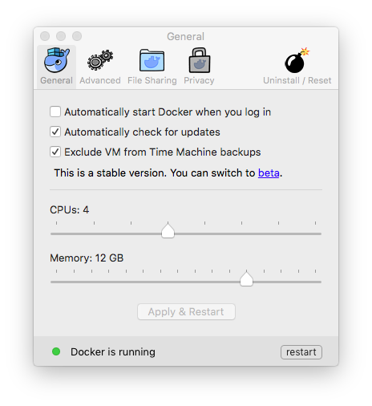
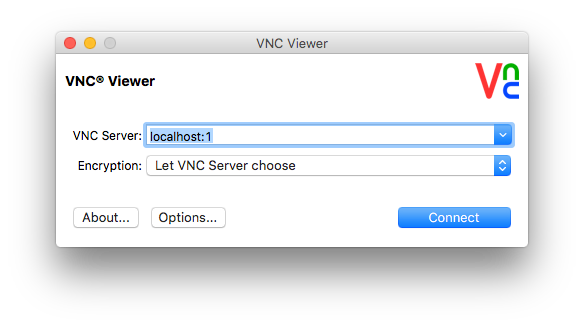

Copyright &copy; 2016, 2017  International Business Machines Corporation
All Rights Reserved


## pring/centos7-streams4212-dev

This repository contains a Dockerfile and associated scripts, intended for use with [Docker](https://www.docker.com/). It creates a container for IBM Streams application development, consisting of:

* **IBM Streams release 4.2.1.2** 
* CentOS release 7
* Xfce desktop version 4
* Java 1.8
* Python 2.7 and 3.5
* servers for SSH and VNC access
* lots of open-source utilities, tools, and libraries

Connections to the Internet and the IBM internal network are required to build the container. The complete procedure will take about 20 minutes with a fast network connection, and will produce a container of about 5 GB.

The container provides Xfce desktops for those who prefer to develop applications with GUI tools, and also supports SSH access for those who prefer command-line tools.


### quick start procedure

The container and associated scripts are described in detail below, but if you are familiar with Docker, then you may want to follow this procedure to get started quickly:

* install [Docker](https://www.docker.com)
* increase the default processor and memory resources allocated to Docker
* get the ['centos7-streams4212-dev'](https://github.ibm.com/pring/centos7-streams4212-dev) repository
* launch the 'createImage.sh' script, and do something else for about half an hour
* execute the 'startContainer.sh' script to start the container
* login to the container's Xfce desktop by connecting a VNC viewer to 'localhost:5901'
* login to the container's command line with 'ssh -p 2222 streamsdev@localhost'
* transfer files between host $HOME/dockerhome.centos7/streamsdev and container /home/streamsdev

All passwords in the container are initially set to 'password'.


### creating a container

First, install [Docker for Windows](https://docs.docker.com/windows/) or [Docker for Mac](https://docs.docker.com/mac/) (and see [Docker on Windows](https://developer.ibm.com/bluemix/2015/04/16/installing-docker-windows-fixes-common-problems/) for help with common problems, if needed).

The default processor and memory resources Docker allocates for containers are insufficient for Streams application development. Use the Docker 'Preferences' panel to increase them as much as your laptop's resources allow, like this:



Then clone or download the ['centos7-streams4212-dev'](https://github.ibm.com/pring/centos7-streams4212-dev) repository to your computer. To create an image for the Docker container, open a Terminal window and execute this script at the command prompt:

    $HOME/git/centos7-streams4212-dev/createImage.sh

This script uses the Dockerfile to create an image for the container with all of the components required to develop Streams applications. This will take a long time, even with a fast network connection. However, Docker caches intermediate results after each step of the Dockerfile, so if it hangs at any point because a server does not respond, you can cancel with 'Control-C' and try again later. Docker will skip the steps that completed successfully and resume where it was cancelled using the intermediate results.

The image created for the container includes these accounts:

* '**streamsdev**' is a user account for developing Streams applications. Its home directory is mounted from the host computer's file system. It has an Xfce desktop that can be access via VNC and a command line that can be accessed via SSH (see 'accessing the container' below).

* '**streamsalt**' is another user account for developing Streams applications. Its home directory is mounted from the host computer's file system. 

* '**streamsadmin**' is an administrator account for Streams. It owns the installed Streams product files, but is not otherwise used, so it is not necessary to login as 'streamsadmin'.

* '**root**' is the Linux 'superuser' account. Both 'streamsdev' and 'streamsalt' have unrestricted 'sudo' privileges, so it is not necessary to login directly as 'root'.

The image for the container has these external connection points:

* TCP port 22 is exposed for logging into the container via SSH
* TCP port 5901 is exposed for connecting a VNC viewer to its Xfce desktop
* The initial VNC screen dimensions are set from the VNC_GEOMETRY environment variable
* The /home/streamsdev directory is mounted from the host computer's file system
* The /home/streamsalt directory is mounted from the host computer's file system


### accessing the container

After the image for the container has been created, you can start it by executing this script at the Terminal window's command prompt:

    $HOME/git/centos7-streams4212-dev/startContainer.sh

The home directories of the 'streamsdev' and 'streamsalt' user accounts are mounted from the '$HOME/dockerhome.centos7/streamsdev' and '$HOME/dockerhome.centos7/streamsalt' directories, respectively, in the host computer's file system. If these directories do not exist, the 'startContainer.sh' script will create them and initialize them with basic Linux configuration files. If the host computer's home directory has an SSH configuration directory $HOME/.ssh, the script will copy it into the home directories of the 'streamsdev' and 'streamsalt' user accounts.

You can use the Xfce desktop of the 'streamsdev' user account by connecting a VNC viewer to the address 'localhost:1' or 'localhost:5901', depending on which viewer you use, and entering the password 'password':



Or, you can login to the 'streamsdev' user account with SSH by typing this command at a prompt in a Terminal window, and entering the password 'password':

    ssh -p 2222 streamsdev@localhost

Or, you can execute Linux commands inside the container without logging into it or using the Xfce desktop by specifying them as arguments to the 'ssh' command:

    ssh -p 2222 streamsdev@localhost streamtool version

The 'root' and 'streamsadmin' accounts do not have Xfce desktops, but they can be accessed via SSH with the password 'password'. The 'streamsdev' and 'streamsalt' user accounts have full 'sudo' privileges, so it is not necessary to login to the 'root' or 'streamsadmin' accounts directly.

The container can be stopped by executing this script at the Terminal window's command prompt:

    $HOME/git/centos7-streams4212-dev/stopContainer.sh


### using the container

After starting the container and connecting a VNC viewer to its Xfce desktop, use the icons at the top of the desktop to launch common development tools:


* the 'Display' icon changes the size of the Xfce desktop
* the 'Terminal' icon opens a Bash window with a command-line prompt
* the 'File Manager' icon opens a directory and file explorer
* the 'Gedit' icon opens the Gnome text editor
* the 'Firefox' icon opens the Firefox web browser
* the 'Emacs' icon opens the Gnu Emacs text editor
* the 'Wireshark' icon opens the Wireshark network analyzer tool
* the 'Streams Studio' icon opens the Eclipse development platform
* the 'top' icon opens the 'top' system status tool

There are also several utility scripts in the container that can be executed by opening a Terminal window and entering these commands at a prompt:

* **configureSSH.sh** creates SSH configuration files for the user account, if they do not already exist. Note that the 'startContainer.sh' script described above copies your SSH configuration, if you have one, from your laptop's file system into the user account's home directory, when it is initialized. The 'configureSSH.sh' script is needed only if you do not already have an SSH configuration.

* **startStreamsInstance.sh** starts a Streams domain and instance, if they are not already running, after creating them, if they do not yet exist. The names are taken from the $STREAMS_DOMAIN_ID and $STEAMS_INSTANCE_ID environment variables, which by default are 'StreamsDomain' and 'StreamsInstance', respectively.

* **stopStreamsInstance.sh** stops the Streams domain and instance, if they are running.

* **removeStreamsInstance.sh** stops the Streams domain and instance, if they are running, and then removes them.

None of these scripts accept any arguments, but some of them have static parameters that can be changed by altering variables declared at the top of the script file.


### creating additional connections to the container

The first time you execute the 'startContainer.sh' script, it creates the container from the image built by the 'createImage.sh' script. This includes connecting the container's network ports to your laptop's network, and sharing directories between the container and your laptop's file system. By default, the 'startContainer.sh' script creates these connections:

| in container               |       | in laptop |
|                        --: | :---: | :--- |
| SSH port 22                | <-->  | ssh -p 2222 streamsdev@localhost |
| VNC port 5901              | <-->  | VNC to 'localhost:5901' for 'streamsdev' desktop |
| directory /home/streamsdev | <-->  | directory $HOME/dockerhome.centos7/streamsdev |
| directory /home/streamsalt | <-->  | directory $HOME/dockerhome.centos7/streamsalt |

You can connect additional network ports and share additional directories when the container is created. For example, you might need to connect these network ports and shared directories between the container and your laptop:

| in container               |       | in laptop |
|                        --: | :---: | :--- |
| HTTP port 8080             | <-->  | Firefox to 'http://localhost:8080' for HTTP server |
| HTTP port 8888             | <-->  | Firefox to 'http://localhost:8888' for HTTP server |
| directory /mnt             | <-->  | directory $HOME/scratch |

To do this, modify the 'dockerCreateParameters' variable in the 'startContainer.sh' script, like this:
```
dockerCreateParameters=(
   --name $containerName
   --hostname streamshost
   --dns 9.0.130.50
   --dns 192.168.65.1
   --dns-search watson.ibm.com
   --dns-search ibm.com
   --dns-search local
   --publish 2222:22
   --publish 5901:5901
   --publish 5902:5902
   --publish 8080:8080                                     ### connect additional TCP port
   --publish 8888:8888                                     ### connect additional TCP port
   --env VNC_GEOMETRY=1440x900
   --volume $homeDirectory/streamsdev:/home/streamsdev:rw
   --volume $homeDirectory/streamsalt:/home/streamsalt:rw
   --volume $HOME/scratch:/mnt:ro                          ### share additional directory
  )
```
After modifying the 'startContainer.sh' script, stop and delete the old container, then execute it again, like this:

    $HOME/git/centos7-streams4212-dev/stopContainer.sh
    docker rm centos7-streams4212-dev
    $HOME/git/centos7-streams4212-dev/startContainer.sh

Then re-connect your VNC viewer to the Xfce desktop in the container, or log back in with SSH.


### installing Mongo database

If you need the Mongo database, you can install it in the container by entering this command at a Linux Terminal window at a command prompt:

    sudo yum install mongodb python-pymongo php-pecl-mongo


### installing KDE desktop

If you prefer to use the KDE desktop instead of Xfce, you can install it in the container by entering this command in a Linux Terminal window at a command prompt:

    sudo yum group install kde

To switch from the Xfce desktop to KDE, edit the /home/streamsdev/.vnc/xstartup file and change the last line from "startxfce4 &" to "startkde &". Then stop the container and start it again.


### transferring files between the container and your laptop

The home directories of the 'streamsdev' and 'streamsalt' user accounts are mounted from directories in your laptop's file system, like this:

    in container          in laptop's file system
    ----------------      -----------------------------
    /home/streamsdev <--> $HOME/dockerhome.centos7/streamsdev
    /home/streamsalt <--> $HOME/dockerhome.centos7/streamsalt

You can transfer files between the container and other directories in your laptop's file system by dragging them into or out of these directories.


### transferring the container to another machine

The container can be packaged for transfer to another machine by executing this script:

    $HOME/git/centos7-streams4212-dev/packContainer.sh

This script produces a package '$HOME/docker.centos7-script4212.tar.gz' of about 3.0 GB that contains everything in the container except the home directories of the 'streamsdev' and 'streamsalt' user accounts, which are mounted from the host computer's file system, and are therefore not included in the container.

After the package '$HOME/docker.centos7-script4212.tar.gz' has been transferred to another machine, the container can be unpacked by executing this script on that machine:

    $HOME/git/centos7-streams4212-dev/unpackContainer.sh

The container can then be started on the other machine with the 'startContainer.sh' script. If the user accounts' home directories '$HOME/dockerhome.centos7/streamsdev' and '$HOME/dockerhome.centos7/streamsalt' have also been transferred to the other machine, the script will mount them in the container. If not, the 'startContainer.sh' script will create new home directories for the user accounts.


### workaround for clock drift problem
 
The Docker's system clock may drift out of sync with the laptop's system clock. If so, Docker's clock can be manually synchronized by entering this command at a Mac OS Terminal prompt:

    screen ~/Library/Containers/com.docker.docker/Data/com.docker.driver.amd64-linux/tty

At the 'moby' login prompt, enter 'root'.

Then enter this command at the 'moby' command prompt:

    hwclock -s

To exit 'moby', type 'control-A' and then type 'D'.
